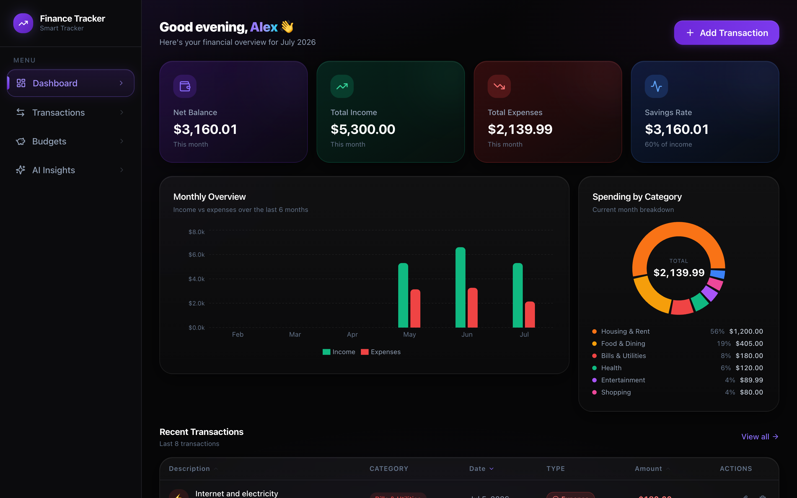
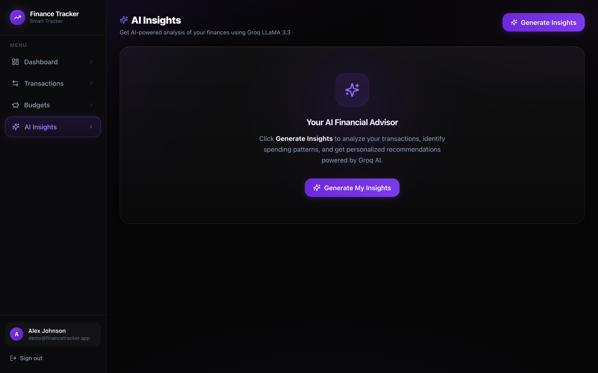
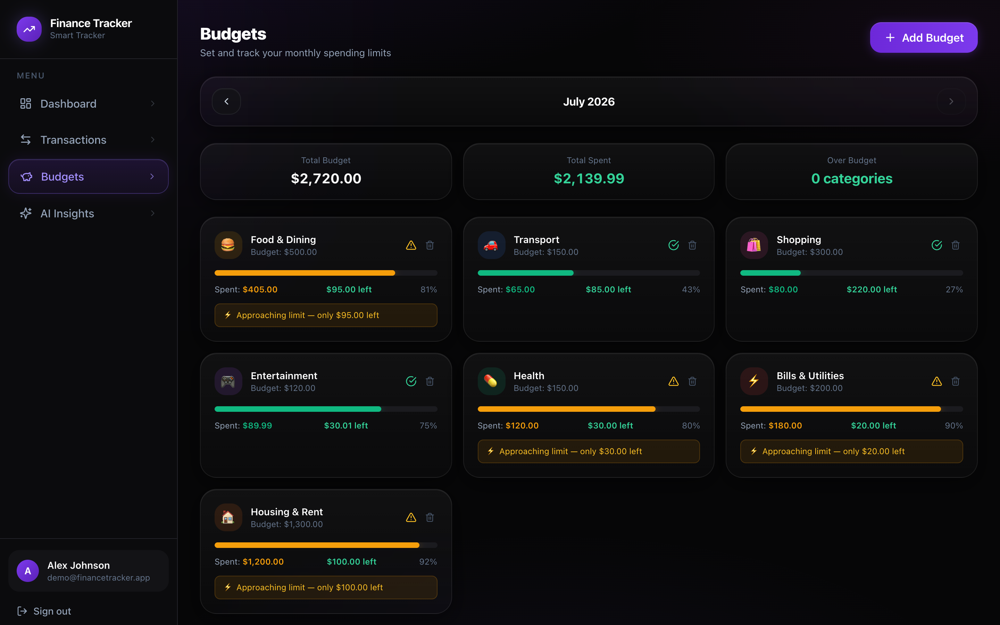
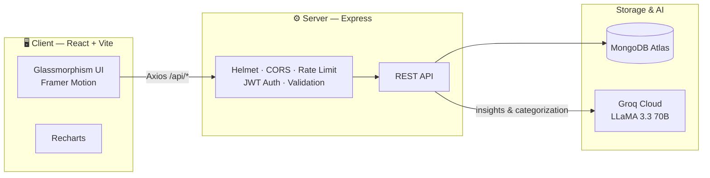

<div align="left">
  <div style="background: linear-gradient(135deg, #6366f1, #a855f7, #ec4899); padding: 2px; border-radius: 20px; display: inline-block; margin-bottom: 20px;">
    <div style="background: #0f172a; padding: 20px 40px; border-radius: 18px;">
      <h1 style="margin: 0; color: white;">🚀 AI Finance Tracker</h1>
      <p style="margin: 5px 0 0 0; color: #94a3b8; font-size: 1.1em;">AI-Powered Personal Finance Tracker</p>
    </div>
  </div>

  <p>
    <b>Take control of your financial future with intelligent insights, smart budgeting, and beautiful analytics.</b>
  </p>

  <div>
    <a href="https://github.com/aryanranade/finance-tracker/actions/workflows/ci.yml"></a>
    
    
    
    
    
    
    
  </div>

  <br />

  <a href="https://finance-tracker-one-alpha.vercel.app" target="_blank"><b><u><font color="#3b82f6">🟢 View Live Deployment</font></u></b></a>

  <p><i>✨ One-click demo login on the sign-in page — no registration needed.</i></p>
</div>

<br />

## 📸 Screenshots

<div align="center">
  
  <br /><br />
  
  
</div>

---

## ✨ Key Features

- 🤖 **AI-Powered Insights**: Get personalized financial advice, warnings, and predictions powered by Groq's blazing-fast LLaMA 3.3 70B model.
- ⚡ **Smart Auto-Categorization**: Type "bought a latte" and the AI instantly categorizes it as `Food & Dining`.
- 📊 **Beautiful Visualizations**: Interactive pie charts, monthly bar charts, and SVG gauges built with Recharts.
- 🎯 **Budget Management**: Set monthly limits per category and track your actual spending in real-time with visual progress bars.
- 💯 **Financial Health Score**: A proprietary 0-100 score calculated based on your savings ratio, budget adherence, and spending consistency.
- 🌙 **Premium Glassmorphism UI**: Dark aurora backdrop, frosted-glass cards, glowing accents — polished and responsive.
- 🎬 **Tasteful Motion**: Framer Motion page transitions, staggered reveals, animated count-ups, and spring modals throughout.
- 🔒 **Secure Authentication**: JWT-based authentication with bcrypt password hashing.

---

## 🛠️ Tech Stack

### Frontend (Client)
- **Framework**: React 18 + Vite
- **Styling**: Tailwind CSS v3 (Custom Dark Theme + Glassmorphism)
- **Animations**: Framer Motion (page transitions, staggered reveals, count-ups)
- **Notifications**: Sonner (toast system)
- **Charts**: Recharts
- **Icons**: Lucide React
- **HTTP Client**: Axios

### Backend (Server)
- **Runtime**: Node.js
- **Framework**: Express.js
- **Database**: MongoDB (Mongoose Object Modeling)
- **Security**: Helmet, express-validator, JWT
- **AI Integration**: Groq SDK (`llama-3.3-70b-versatile`)

---

## 🏗️ Architecture



---

## 🚀 Live Demo & Deployment

This application is built to be deployed 100% for free using modern cloud providers:

- **Frontend Hosting**: [Vercel](https://vercel.com)
- **Backend API Hosting**: [Render](https://render.com)
- **Database**: [MongoDB Atlas (M0 Tier)](https://mongodb.com/atlas)
- **AI Engine**: [Groq Cloud](https://console.groq.com)

---

## 💻 Local Development

Running locally takes **two commands**. 🎉

### 1. Prerequisites
- Node.js (v18 or newer)
- A free [MongoDB Atlas](https://mongodb.com) database URI
- A free [Groq API Key](https://console.groq.com)

### 2. One-time setup
From the **project root**:
```bash
npm run setup
```
This installs every dependency (root, server, and client) and creates `server/.env` from the template.

Then open `server/.env` and fill in your real values:
```env
PORT=5001                 # 5000 is reserved by macOS AirPlay — leave this as 5001
MONGODB_URI=your_mongodb_connection_string
JWT_SECRET=super_secret_string
JWT_EXPIRES_IN=7d
CLIENT_URL=http://localhost:5173,http://127.0.0.1:5173
GROQ_API_KEY=gsk_your_groq_api_key
```

### 3. Run everything
From the **project root**:
```bash
npm run dev
```
That's it — this starts **both** the backend and frontend together with a single command:
- 🖥️  Frontend → http://localhost:5173
- ⚙️  Backend  → http://localhost:5001 (the Vite dev server proxies `/api` to it automatically)

### Handy root scripts
| Command | What it does |
|---------|--------------|
| `npm run dev` | Start backend + frontend together |
| `npm run setup` | Install all deps + bootstrap `.env` |
| `npm run seed` | Seed the database with demo data |
| `npm run build` | Build the frontend for production |
| `npm start` | Run the backend in production mode |

---

## 🔌 API Reference

### Authentication
- `POST /api/auth/register` - Create a new account
- `POST /api/auth/login` - Authenticate and receive JWT
- `GET /api/auth/me` - Get current user profile

### Transactions
- `GET /api/transactions` - Fetch all transactions (supports filtering & sorting)
- `POST /api/transactions` - Create a new transaction
- `PUT /api/transactions/:id` - Update a transaction
- `DELETE /api/transactions/:id` - Delete a transaction
- `GET /api/transactions/export/csv` - Download all data as CSV

### Budgets
- `GET /api/budgets` - Fetch budgets with real-time actual spending calculated
- `POST /api/budgets` - Create or update a category budget
- `DELETE /api/budgets/:id` - Remove a budget

### AI Capabilities
- `GET /api/ai/categorize?description=...` - Ask LLaMA to categorize a raw text string
- `POST /api/ai/insights` - Generate a comprehensive financial report
- `GET /api/ai/health-score` - Calculate the 0-100 proprietary health score

---

## 🔧 Troubleshooting — "where do my env values live?"

If the app won't connect after time away, your local `server/.env` may have placeholder values. The real ones live in your cloud dashboards:

| Value | Where to find it |
|-------|------------------|
| `MONGODB_URI` | **Render** → backend service → *Environment* tab (exact prod value), or **MongoDB Atlas** → Connect → Drivers. If the Atlas M0 cluster was auto-paused from inactivity, hit **Resume** first. |
| `GROQ_API_KEY` | Keys are shown **only once** at creation — if lost, mint a new one free at [console.groq.com/keys](https://console.groq.com/keys). |
| `JWT_SECRET` | Any random string works locally (`node -e "console.log(require('crypto').randomBytes(48).toString('base64url'))"`). |

Also: macOS reserves port **5000** for AirPlay — this project deliberately uses **5001**.

---

## 🗺️ Roadmap

See [ROADMAP.md](ROADMAP.md) for the full improvement plan (frontend revamp ✅, tests & CI ✅, rate limiting ✅, upcoming: refresh tokens, docker-compose, and more).

---

## 🛡️ Security Measures
- **Password Hashing**: Bcrypt with salt rounds (cost factor 12).
- **Stateless Auth**: JSON Web Tokens (JWT) for secure session management.
- **Data Isolation**: All database queries are strictly scoped to the authenticated `userId`.
- **HTTP Headers**: Helmet.js prevents cross-site scripting (XSS) and clickjacking.
- **Input Validation**: Express-validator sanitizes all incoming request bodies.
- **Rate Limiting**: Brute-force protection on auth routes (20 req/15min) and AI-quota protection (30 req/15min).
- **Sanitized Errors**: Internal error details are never leaked to clients in production.

---
